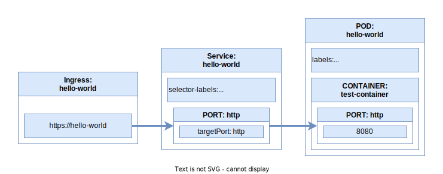
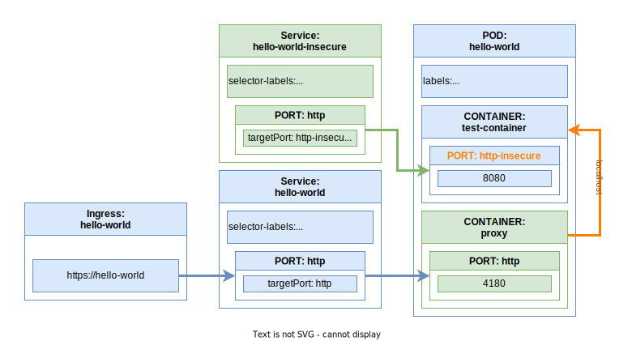

# **Oauth2 Proxy Admission Controller**

## Introduction

This project consists of Kubernetes Mutatitng Webhook Admission Controller written in Async FastAPI in Python.
It's purpose is to inject the [oauth2-proxy](https://github.com/oauth2-proxy/oauth2-proxy) container,
so the vertical traffic cannot go unauthenticated to the underlying application.
The injection must be as painless as it's possible, while also not breaking hotizontal communication.

The procedure goes as follows:

1. When new container get's created Kubernetes calls the admission controller
2. The controller parses POD from the request- it gets it's main container and the container's main port
3. Then the controller renames the port in the container and adds a suffix to it `-insecure`
4. Afterwards the controller injects the `oauth2proxy` container and names it's port with the
previous name of the main container's main port.
5. Once the POD's definition gets altered, controller searches for a service with selector labels
matching PODs and port targetting original main port
6. If such service get's found, it gets copied with `-insecure` suffix and target port pointing to port with the same suffix.

After the above gets completed, POD with oauth2proxy gets created and the traffic automatically
goes through the `oauth2proxy` container.

Because this happens inside Admission Controller, there is no point in time, where the underlying
service gets exposed without authentication/authorisation enforced properly.

Here is a graphical representation of what happens:

1. State before:



2. State after (green objects == added, yellow objects == modified):




## Installation

### Helm chart

The **Oauth2 Proxy Admission Controller** can be installed using provided helm chart either by cloning
the repository and using it "locally", or through provided helm repository:

``` shell
helm repo add szymonrychu https://szymonrychu.github.io/selfhosted-kubernetes-charts/
helm repo update
helm install \
  --set proxy.oidcIssuerUrl=<url to keycloak realm> \
  --set proxy.cookieName=<name of the auth cookie> \
  oauth2-proxy-admission-controller szymonrychu/oauth2-proxy-admission-controller
```

The repository consists of last 10 chart releases.

## Configuration

In order to properly configure `oauth2proxy`, the controller needs to know how to securely call
Keycloak instance. The configuration can be provided in 3 ways:

1. Through default secret created with the helm chart. It's possible there to provide all necessary
configuration keys- this option useful, when there is only 1 Keycloak client for multiple underlying
microservices and there is no need to differenciate between them
2. Through a secret created somewhere in the cluster- information from it will override defaults
3. Through annotations- each of the values from secrets might get overriden with values
provided with them- more on that below

Merging (top to bottom) of the 3 layers of configuration must result in a configuration containing keys like so:

* proxy-container-name
* proxy-provider
* proxy-http-port
* proxy-email-domains
* proxy-allowed-groups
* proxy-client-id
* proxy-client-secret
* proxy-redirect-url
* proxy-issuer-url
* proxy-cookie-name
* proxy-cookie-domain
* proxy-cookie-secret
* proxy-container-tag
* proxy-container-image-pull-policy

where keys as below are always provided with the helm chart:

* proxy-container-name
* proxy-provider
* proxy-http-port
* proxy-container-image
* proxy-container-tag
* proxy-container-image-pull-policy

### Required and optional POD annotations

In order to enable the injection, it's necessary to provide at least one annotation in the PODs definition:

``` kubernetes
oauth2-proxy-admission/secret-name: <name of the client specific secret>
```

It's also possible to override the namespace of the secret with:

``` kubernetes
oauth2-proxy-admission/secret-namespace: <namepsace with client specific secret>
```

In general values in annotations are preceeded with `oauth2-proxy-admission/` prefix,
so e.g. in order to override `oauth2proxy` container tag, all that's necessary is adding an annotation as below:

``` kubernetes
oauth2-proxy-admission/proxy-container-tag: v7.5.1
```

It's also possible to pick specific container and port from a POD (in case where container or
it's port are not the 1st ones on their lists)- below annotations will get the job done:

``` kubernetes
oauth2-proxy-admission/patch-container-name: <name of the container, that should be secured with the proxy>
oauth2-proxy-admission/proxy-port-name: <name of the container's port that should be routed through proxy>
oauth2-proxy-admission/patch-port-number: <number of the container's port that should be routed through proxy-
in case the name is not present>
```

### Terraform module automating Keyclak configuration and Secret creation

The POD specific configuration can be provided with dedicated terraform module,
that will also take care of the Keycloak configuration.
You can simply use it as in the example below:

``` terraform
data "keycloak_realm" "realm" {
  realm = "<name of the realm where the client should be crated>"
}

resource "keycloak_openid_client_scope" "groups" {
  realm_id               = data.keycloak_realm.realm.id
  name                   = "groups"
  include_in_token_scope = true
  gui_order              = 1
}

resource "keycloak_openid_group_membership_protocol_mapper" "groups" {
  realm_id        = data.keycloak_realm.realm.id
  client_scope_id = keycloak_openid_client_scope.groups.id
  name            = "groups"
  claim_name      = "groups"
  full_path       = false
}

module "client" {
  source = "github.com/szymonrychu/oauth2-proxy-admission-controller.git//terraform_keycloak_client?ref=0.1.1"

  keycloak_url             = "<keycloak https url>"
  keycloak_client_id       = "<id of the newly created client>"
  keycloak_client_hostname = "<client domain>"

  kubernetes_secret_namespace = "<namespace where the secret should be created>"

  kuberenetes_proxy_cookie_secret = "<name of the cookie secret>"

  keycloak_openid_client_scope_name = keycloak_openid_client_scope.groups.name
}
```
